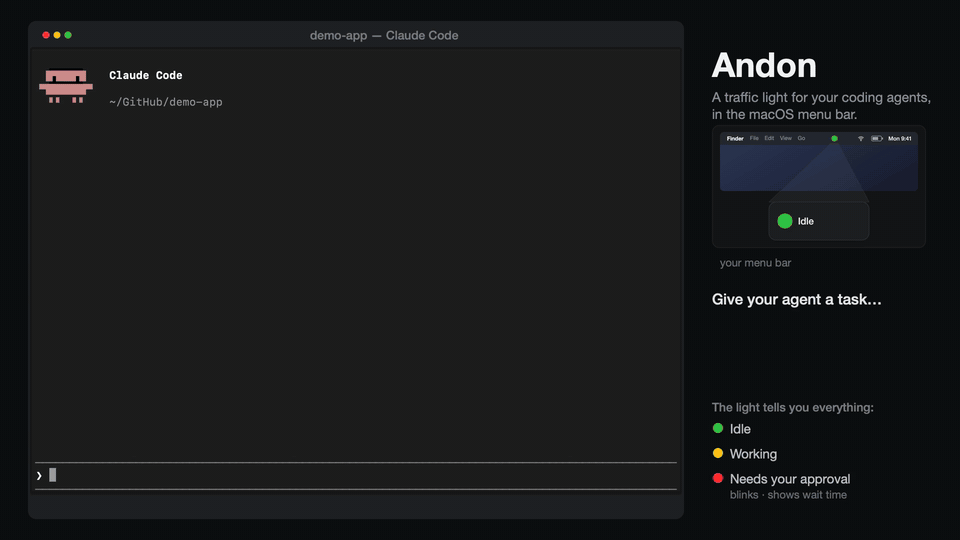

# Andon

**[日本語版 README はこちら](README.ja.md)**

Traffic-light status for your AI coding agents (Claude Code, Codex, Antigravity, ...) in the macOS menu bar.



Named after the [andon](https://en.wikipedia.org/wiki/Andon_(manufacturing)) light in the Toyota Production System — the lamp that turns on when a production line stops and a human is needed. Same idea here: when you run coding agents in the background, the painful failure mode is not noticing that one of them has been sitting there waiting for your approval. Andon makes that state impossible to miss, without making any noise: no sounds, no popups, meeting-safe. Optional push notifications to your phone (via ntfy) cover the time you are away from the Mac.

## Status display

| Icon | State | Meaning |
|------|-------|---------|
| 🔴 Red | waiting | Waiting for approval/input. Your action is needed (shows a count when multiple). Blinks, with elapsed time |
| 🟡 Yellow | running | Working |
| 🟢 Green | idle | Idle (task finished) |
| ⚪ Outline | — | No active sessions |

With multiple sessions, the most urgent state wins. Click the icon for per-session details (project, state, elapsed time).

## Install (dmg, no build required)

Download `Andon-<version>.dmg` from [Releases](https://github.com/khr8959/andon/releases) and drag `Andon.app` into `Applications`.

> **First launch**: the app is unsigned (ad-hoc signature only, not notarized), so Gatekeeper blocks it. Right-click the app > "Open" > "Open". On macOS 15+, use "Open Anyway" at the bottom of System Settings > Privacy & Security if needed.

The agent-integration scripts and config templates are bundled inside the app. In Terminal:

```sh
/Applications/Andon.app/Contents/Resources/generate-configs.sh
```

This generates a set of configs referencing the bundled hooks into `~/Library/Application Support/Andon/config/`; follow the printed instructions to merge them into the agents you use (see the integration sections below — when using the dmg, read `build/config/` in those sections as this output directory).

## Set up from source

All you need is macOS 14+ and the Xcode Command Line Tools (`swift` and `python3`).

Clone the repository (or place it anywhere) and:

```sh
./setup.sh   # build -> install to /Applications -> generate agent configs into build/config/
open /Applications/Andon.app
```

`setup.sh` expands the path placeholder in the `examples/` templates to the actual repository location and writes the results to `build/config/`. Then merge the generated configs following the integration sections below. **If you move or rename the repository, re-run `./setup.sh --config-only` and re-apply the configs** (they reference the scripts by absolute path).

To just try it without installing to `/Applications`:

```sh
./make-app.sh            # builds build/Andon.app
open build/Andon.app
```

To start at login, add `Andon.app` in `System Settings > General > Login Items`.

> For development you can run the raw binary (`swift build -c release && .build/release/Andon &`), but it dies with the terminal session; use the `.app` for daily use.

## Claude Code integration

Status is reported via hooks. Merge the contents of `build/config/claude-settings-hooks.json` (generated by `setup.sh`) into `~/.claude/settings.json`.

Event-to-state mapping:

- `UserPromptSubmit` / `PreToolUse` / `PostToolUse` → running (🟡)
- `PermissionRequest` (approval request) / `Notification` (waiting for input etc.) → waiting (🔴)
- `PermissionDenied` → back to running (🟡)
- `Stop` (response finished) / `SessionStart` → idle (🟢)
- `SessionEnd` → removed from display

> **Note (2.1.x)**: As of Claude Code 2.1.200, approval prompts do not fire `Notification`; they use the dedicated `PermissionRequest` event. If you only register `Notification`, the icon never turns 🔴 — always register `PermissionRequest` too (`Notification` is kept for older versions). Known limitation: after you approve, the state stays 🔴 until the next event (`PostToolUse`), so a long-running approved command keeps showing 🔴 for a while.

## Phone notifications (optional)

Configure in the panel under "Phone notifications (ntfy)". Off by default.

1. Install the [ntfy](https://ntfy.sh) app on your phone and subscribe to a hard-to-guess topic name (e.g. `my-agents-x7k2`)
2. Enter the same topic in the panel and turn on "Push to phone on waiting"

Anyone who knows an ntfy.sh topic name can subscribe to it, so include a random string in the name. A self-hosted ntfy server can be set in the "ntfy server" field.

## Codex CLI integration

> **Status: red (waiting) transition verified on a real machine (0.139.0).** Requires the trust approval below.

Codex (verified with 0.139.0) registers hooks in `~/.codex/hooks.json`. Merge the contents of `build/config/codex-hooks.json` (generated by `setup.sh`).

- The `PermissionRequest` event detects waiting (🔴). Verified transition on a real machine: `UserPromptSubmit` (🟡) → `PreToolUse` (🟡) → `PermissionRequest` (🔴) → `Stop` (🟢), e.g. when asking for a file write under a read-only sandbox
- The `notify` setting in `config.toml` is not used, so this does not conflict with existing notify integrations
- **Important**: Codex refuses to run arbitrary-code hooks until you "trust" them (it records a hash of the hook definition and only runs approved ones). After registering, **run `/hooks` inside interactive `codex` and approve the andon hook**. Status is not reported until then
- Codex has no SessionEnd, so finished sessions are cleared via "Clear completed" or auto-deleted after 24 hours

## Antigravity CLI integration

> **Status: poller approach verified on a real machine (1.0.16).** 🟡 running / 🔴 approval dialog shown / 🟢 idle all work.

agy does have a hook mechanism, but **no hook event signals "waiting for approval"** (see below), so the recommended approach is `hooks/agy_status_poller.py`, a dedicated script that polls the language server API. It detects 🔴 (approval dialog visible), which hooks cannot.

```sh
python3 hooks/agy_status_poller.py            # daemon (3-second interval)
python3 hooks/agy_status_poller.py --once -v  # run once (for testing)
```

How it works:

- Auto-discovers running agy processes (the CLI's built-in language server) and the hub language server used alongside IDEs via `ps` / `lsof`, and fetches conversations and run states over Connect RPC. Short-lived headless runs (`agy -p`) are picked up within seconds
- `CASCADE_RUN_STATUS_RUNNING` etc. → 🟡; command-approval dialog visible (`CORTEX_STEP_STATUS_WAITING`) → 🔴; `IDLE` → 🟢. Status files for finished conversations are removed automatically
- **Limitations**: if agy stops by asking a question in chat text without invoking a tool, the API cannot distinguish this from a normal turn end, so it shows 🟢 (same treatment as Claude Code stopping with a text question). Headless runs auto-approve commands and therefore never show 🔴

To start the poller at login, register it with launchd (the plist generated by `setup.sh` has the paths resolved):

```sh
cp build/config/andon-agy-poller.plist ~/Library/LaunchAgents/
launchctl bootstrap gui/$(id -u) ~/Library/LaunchAgents/andon-agy-poller.plist
```

### Hook approach (secondary, verified)

agy also supports JSON hooks, registered via a plugin (`cd build/config/antigravity-plugin && agy plugin install .`) or a workspace `.agents/hooks.json` (place `build/config/antigravity-hooks.json`). 🟡/🟢 transitions verified on a real machine. However, **there is no hook event for waiting-for-approval** (only PreInvocation / PreToolUse / PostToolUse / PostInvocation / Stop exist), so use the poller if you need 🔴. **Enabling both shows every conversation twice**, so pick one.

Notes on the config format (per agy's built-in doc `builtin/skills/agy-customizations/docs/hooks.md`):

- Top-level keys are hook names. `PreInvocation` / `PostInvocation` / `Stop` take a **flat array of handler objects**; only `PreToolUse` / `PostToolUse` use the `matcher` + `hooks` wrapper. Wrapping flat events in the wrapper makes the parser read them as empty-command handlers: the log says `executing command` but nothing runs
- **Do not use `PreToolUse` for status reporting**: agy requires a `decision` field (allow / deny / ask) in the response JSON, and returning `{}` rejects every tool call with `invalid_args` (verified). The bundled config excludes PreToolUse
- Payloads are camelCase (`conversationId` / `workspacePaths`) and do not include the event name, so the adapter takes it as the second argument (`generic_status_hook.py antigravity Stop`)
- A global `~/.gemini/antigravity-cli/hooks.json` is not read (use a plugin or a workspace `.agents/hooks.json`)

## Gemini CLI integration

> **Status: adapter desk-verified only.** Gemini CLI (0.46.0) has a hook mechanism whose stdin JSON (`hook_event_name` / `session_id` / `cwd`) is Claude Code-compatible, so `generic_status_hook.py gemini` works as-is. However, the test environment could not authenticate (the personal free tier of Gemini Code Assist was discontinued in favor of Antigravity), so live firing has not been verified.

Merge the `hooks` object of `build/config/gemini-settings-hooks.json` (generated by `setup.sh`) into `~/.gemini/settings.json`.

- `BeforeAgent` / `AfterTool` → running (🟡)
- `Notification` (`ToolPermission` = tool approval request) → waiting (🔴)
- `AfterAgent` / `SessionStart` → idle (🟢)
- `SessionEnd` → removed from display
- Note: Gemini hooks break if anything other than the response JSON is printed to stdout, so the adapter prints `{}` when invoked with `gemini`. The timeout unit is milliseconds

## Any other agent (generic protocol)

The app just watches `~/Library/Application Support/Andon/status/`, so any agent becomes visible by writing JSON in this shape.

Filename: `<session_id>.json` (delete it when the session ends)

```json
{
  "session_id": "unique id",
  "state": "waiting | running | idle",
  "cwd": "/path/to/project",
  "message": "reason for waiting (optional)",
  "updated_at": 1751500000.0,
  "agent": "codex"
}
```

- Write atomically (write to a tmp file, then rename) so the reader never sees a partial file
- Files not updated for 24 hours are treated as leftovers and auto-deleted
- If an agent passes `hook_event_name` via stdin JSON, `hooks/generic_status_hook.py <agent-name>` works as-is

## Layout

```
setup.sh                        one-shot setup (build + install + config generation)
generate-configs.sh             config generation (expands the placeholder in examples/;
                                also bundled into the app's Resources for dmg installs)
make-app.sh                     builds the .app (bundles hooks, examples, generate-configs.sh)
make-dmg.sh                     builds the distributable dmg
Sources/Andon/                  the menu bar app (Swift + SwiftUI)
assets/icon.svg                 app icon source (rendered to PNG via headless Chrome;
                                see the comment inside the file)
assets/icon-1024.png            rendered icon (make-app.sh converts it to .icns)
hooks/claude_code_hook.py       Claude Code hooks adapter (event name as argv)
hooks/generic_status_hook.py    generic adapter for Codex / Antigravity CLI etc.
                                (event name from stdin hook_event_name or argv)
hooks/agy_status_poller.py      Antigravity CLI poller (watches the language server API)
antigravity-plugin/             Antigravity CLI plugin (hook approach)
examples/                       config templates for each agent (paths are placeholders;
                                setup.sh expands them into build/config/)
demo/                           demo video and GIF for the README / landing page
```

You can also use `examples/` directly by replacing the placeholder by hand (substitute `/PATH/TO/andon` with the absolute path of the repository).

## License

MIT License ([LICENSE](LICENSE))
